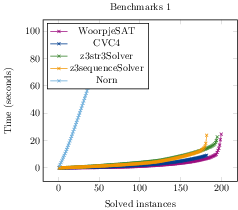
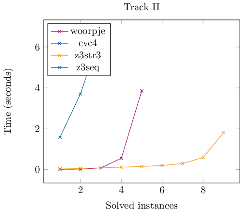
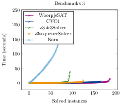
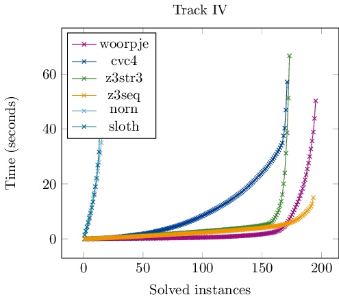
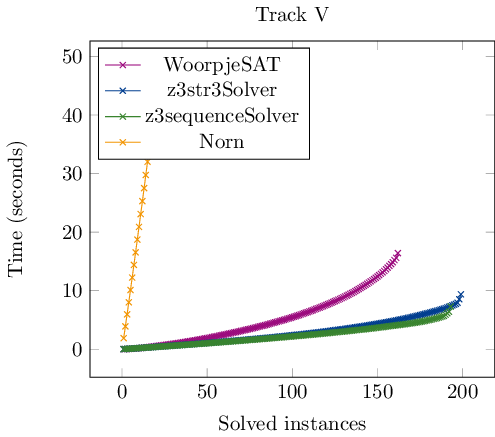

== Benchmarks
For evaluating the performance of Woorpje, we generated
five collections of word equations benchmarks that exhibit a special
structure. The equations are solved with Woorpje and state of the art string solvers
(http://cvc4.cs.stanford.edu/web/[CVC4], https://github.com/z3str/Z3-str[Z3str], Z3Seg and
http://user.it.uu.se/~jarst116/norn/[Norn]).
The benchmarks are available in our Availability section.

For each word equation we ran the solvers and noted if they gave the
correct result, if they timed out and we measured the total time for
solving all equations. The solvers were allowed to run for 30
seconds.

=== First Track
The first track (I) is based on completely random generated string,
where randomly picked string of arbitrary length were replaced by
variables. This guarantees the existence of a solution.The generated
word equations have an upper bound of 15 variables, 10 constants, and
length 300.

[.text-center]

include::bechmark1.txt.table[]

=== Second Track

The second track (II) is based on the idea in Proposition 1 of https://arxiv.org/abs/1702.07922[MFCS2017], where the equation

latexmath:[X_naX_nbX_{n-1}bX_{n-2}\cdots bX_1 =	aX_nX_{n-1}X_{n-1}bX_{n-2}X_{n-2}b \cdots b X_{1}X_{1}baa] is shown to have a minimal solution of exponential length w.r.t. the length of the equation.

[.text-center]

include::bechmark2.txt.table[]

=== Third Track
The third track (III) is based on the second track, but each letter
$b$ is replaced by the left hand side or the right hand side of some
randomly generated word equation (e.g., with the methods from track
(I))

[.text-center]

include::bechmark3.txt.table[]

=== Fourth Track
The fourth track (IV) consists of a system of 100 small random word
equations with at most 6 constant letters, 10 variables and length
60. The hard aspect of this track is solving multiple equations at the
same time.

[.text-center]

include::bechmark4.txt.table[]

=== Fifth Track
The fifth track (V) enriches a system of 30 word equations by suitable linear constraints, as presented in this paper. This track is influenced by the Kaluza benchmark set.

[.text-center]

include::bechmark5.txt.table[]
